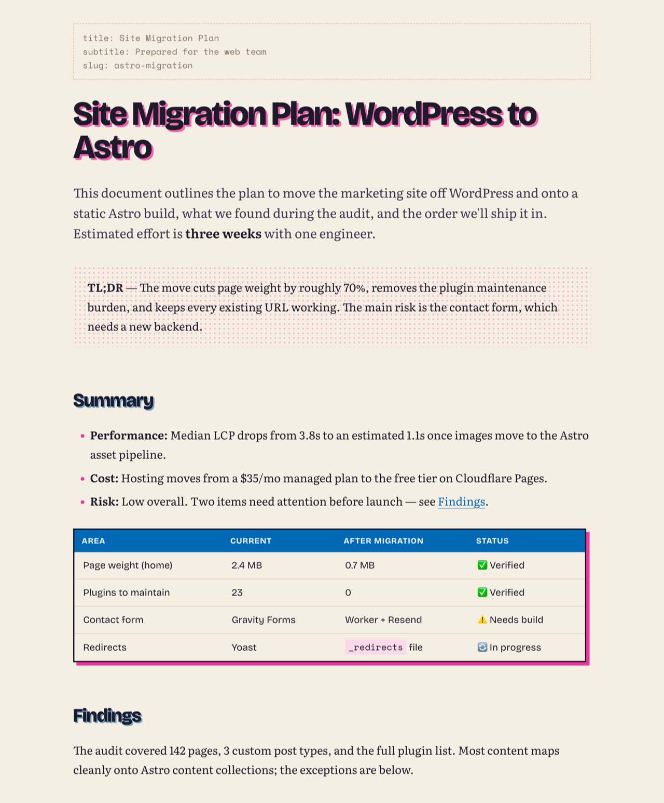
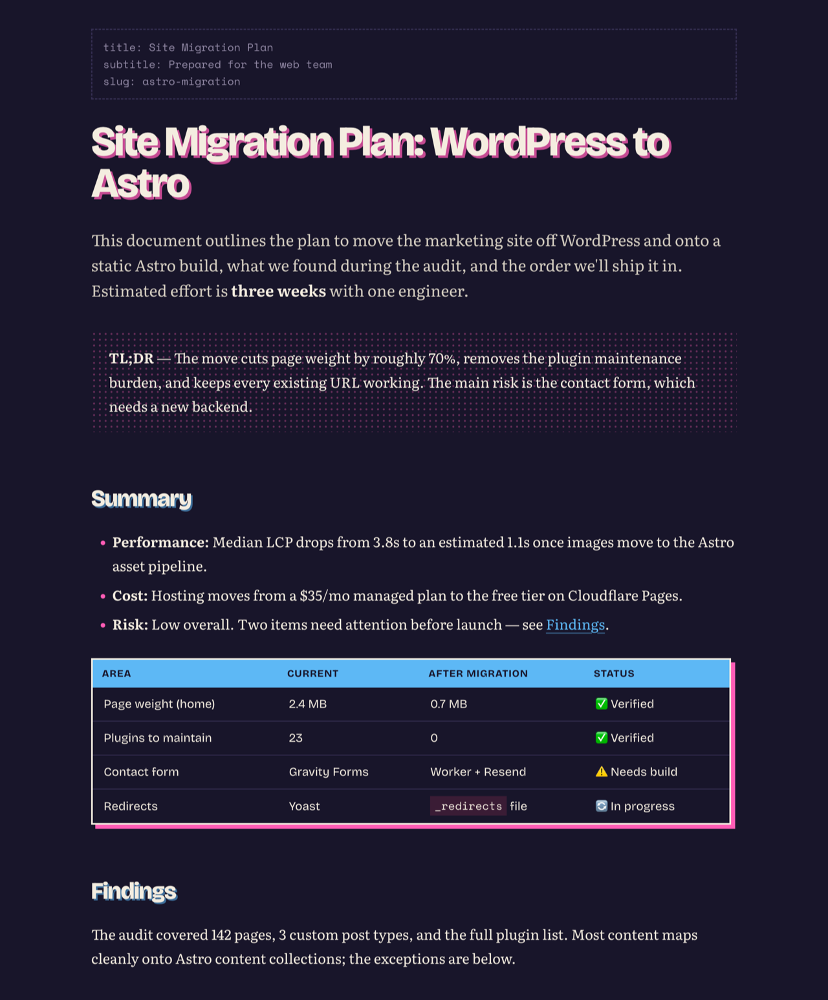

# rizo

A two-ink risograph theme for [Typora](https://typora.io). Heavy grotesque headings printed slightly off-register, a bookish serif for reading, halftone quotes, and inked tables and code blocks — made to turn AI-generated reports into something you actually want to read.

<p>
  
  
</p>

Comes in two flavours, both Fluorescent Pink + Blue:

| Theme       | Paper                 |
| ----------- | --------------------- |
| `rizo`      | Cream                 |
| `rizo-dark` | Midnight              |

PDF export always prints the light inks on white paper, from either theme.

## Install

1. Download the latest `rizo-<version>.zip` from [Releases](../../releases).
2. In Typora: **Settings › Appearance › Open Theme Folder**.
3. Unzip into that folder so it contains `rizo.css`, `rizo-dark.css` and the `rizo/` folder.
4. Restart Typora and pick **Themes › Rizo** or **Themes › Rizo Dark**.

### Follow macOS light / dark automatically

**Settings › Appearance**: enable the separate theme for dark mode, choose **Rizo** for light and **Rizo Dark** for dark.

### Keyboard shortcuts for switching

**System Settings › Keyboard › Keyboard Shortcuts › App Shortcuts**, add Typora, and enter the menu title exactly (`Rizo` or `Rizo Dark`) with a shortcut of your choice.

## What's styled

Headings (h1–h6), lead paragraph, lists and task lists, tables, code blocks with syntax colours and language chips, blockquotes, GitHub-style alerts (`> [!NOTE]`, `TIP`, `IMPORTANT`, `WARNING`, `CAUTION`), YAML front matter, footnotes, highlights, `<kbd>`, TOC, plus Typora's sidebar, outline, search, quick open, menus, focus mode and source mode.

## Fonts

Bundled, so it works offline: [Bricolage Grotesque](https://fonts.google.com/specimen/Bricolage+Grotesque) (headings, UI), [Literata](https://fonts.google.com/specimen/Literata) (body), [Space Mono](https://fonts.google.com/specimen/Space+Mono) (code). All SIL Open Font License 1.1.

## Development

```bash
scripts/install.sh              # symlink this repo into Typora's themes folder
scripts/install.sh --uninstall  # remove the symlinks
scripts/package.sh 1.0.0        # build dist/rizo-1.0.0.zip for a release
python3 scripts/getfonts.py     # re-download the bundled fonts
```

`samples/sample.md` exercises every styled element. `mockups/inks.html` previews alternative ink pairs using the real theme CSS.

## License

Free to use and modify for yourself; not to redistribute. See [LICENSE](LICENSE).
