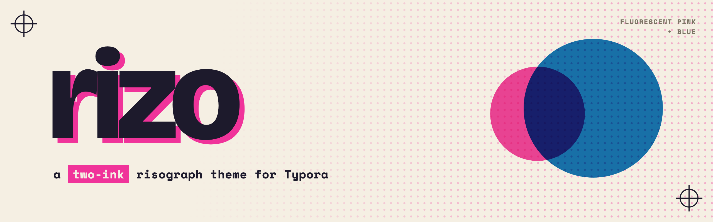
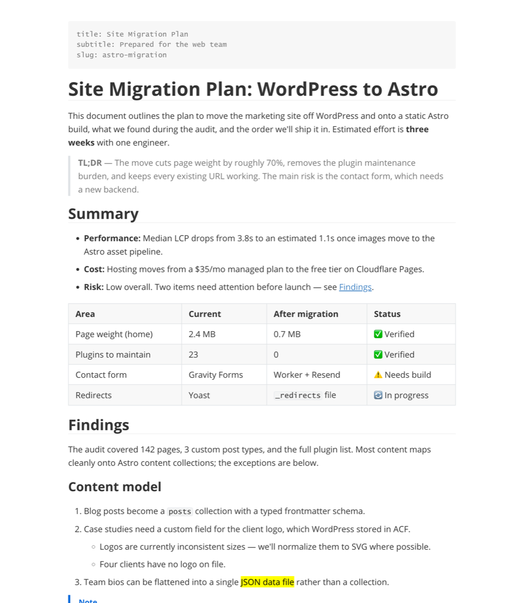
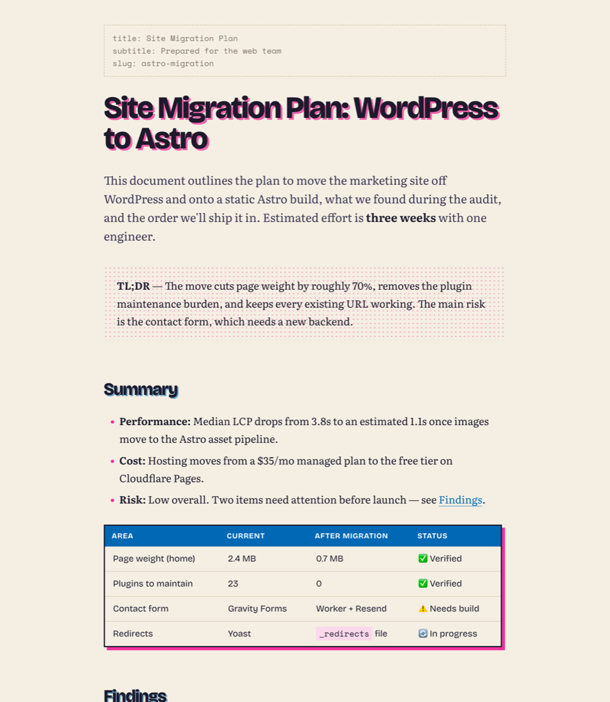
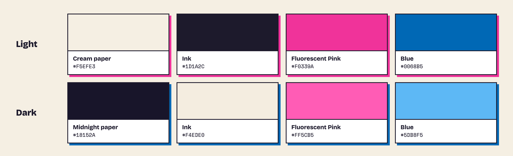
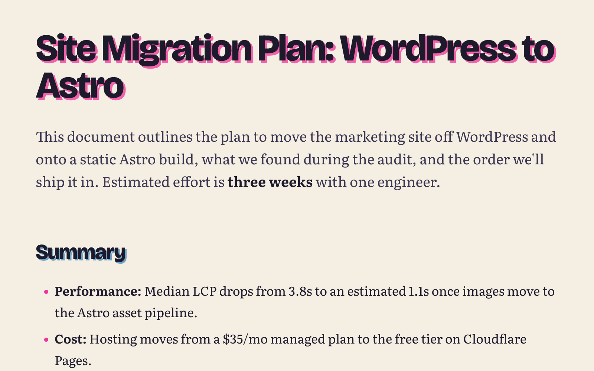
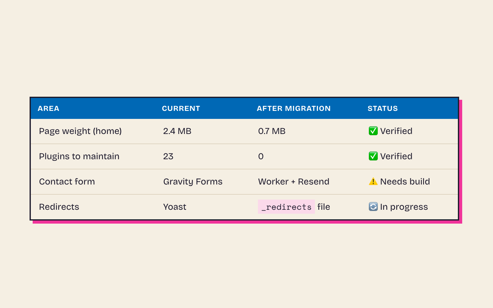
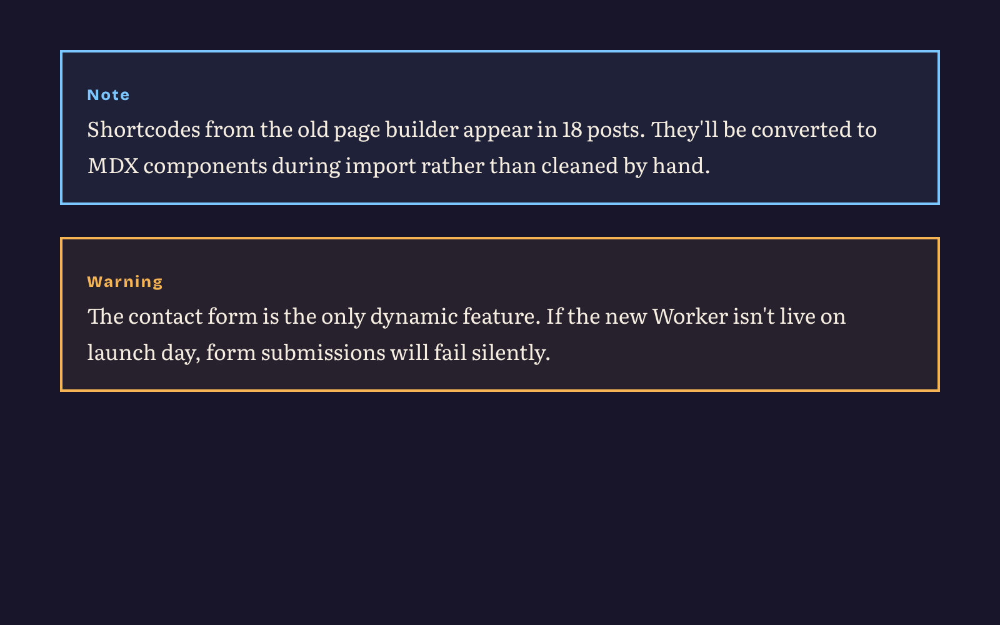
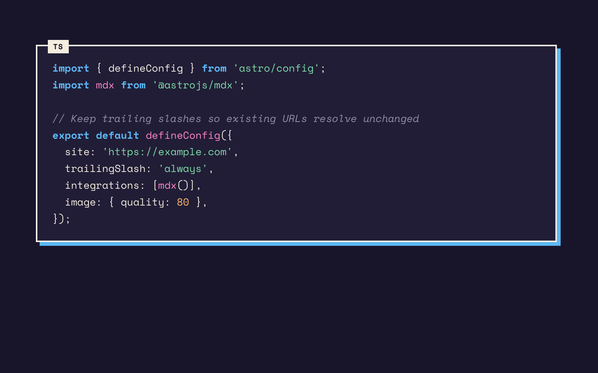
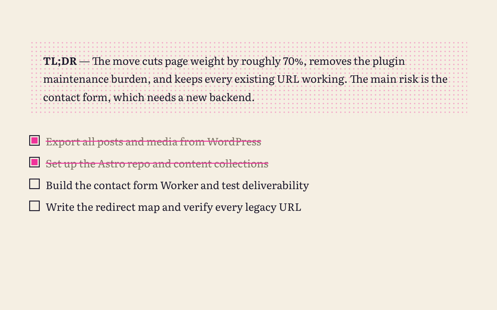
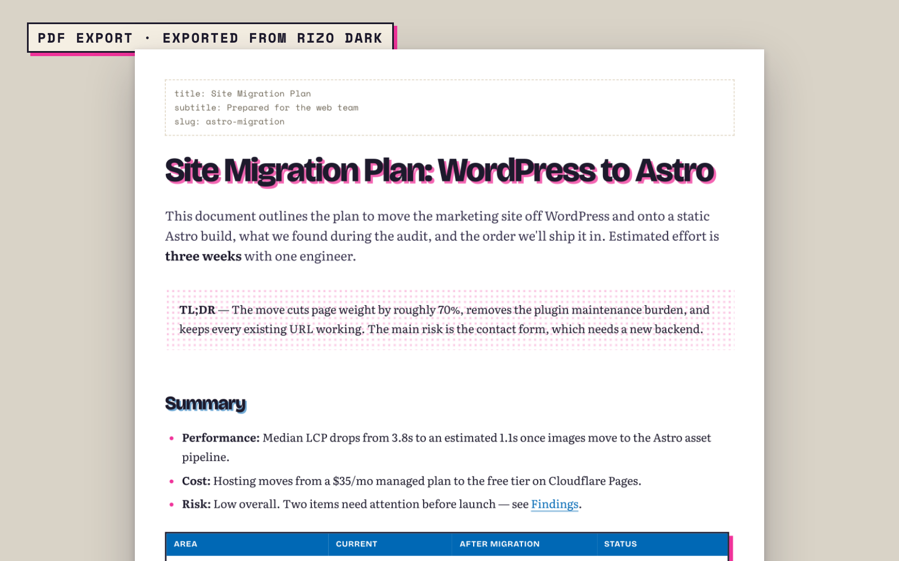

<picture>
  <source media="(prefers-color-scheme: dark)" srcset="docs/readme/banner-dark.png">
  
</picture>

<p align="center">
  <a href="../../releases/latest"></a>
  
  
  
</p>

A two-ink risograph theme for [Typora](https://typora.io). Heavy grotesque headings printed slightly off-register, a bookish serif for reading, halftone quotes, and inked tables and code blocks — made to turn AI-generated reports into something you actually want to read.

## Before and after

The same document, in Typora's default GitHub theme and in rizo.

| Typora default | rizo |
| :---: | :---: |
|  |  |

## Two inks, two papers

Two themes, **Rizo** and **Rizo Dark**, printed in Fluorescent Pink + Blue.



## Install

> [!IMPORTANT]
> Requires **Typora 1.8 or later**. Older versions lack the alert blocks and the modern CSS rizo's colours and shadows rely on.

1. Download the latest `rizo-<version>.zip` from [Releases](../../releases/latest).
2. In Typora: **Settings › Appearance › Open Theme Folder**.
3. Unzip into that folder so it contains `rizo.css`, `rizo-dark.css` and the `rizo/` folder.
4. Restart Typora and pick **Themes › Rizo** or **Themes › Rizo Dark**.

> [!TIP]
> **Follow macOS light / dark automatically:** in **Settings › Appearance**, enable the separate theme for dark mode, then choose **Rizo** for light and **Rizo Dark** for dark.

> [!TIP]
> **Keyboard shortcuts for switching:** in **System Settings › Keyboard › Keyboard Shortcuts › App Shortcuts**, add Typora and enter the menu title exactly (`Rizo` or `Rizo Dark`) with a shortcut of your choice.

## Up close

| | |
| :---: | :---: |
|  |  |
| **Off-register headings** in Bricolage Grotesque, a Literata lead paragraph | **Inked tables** with a blue header row and an offset pink block |
|  |  |
| **Alerts** (`> [!NOTE]`, `TIP`, `IMPORTANT`, `WARNING`, `CAUTION`), shown in Rizo Dark | **Code blocks** in Space Mono with a language chip and ink syntax colours |
|  |  |
| **Halftone quotes** and inked task lists | **PDF export** always prints light inks on white paper, even from Rizo Dark |

Also styled: h1–h6, YAML front matter, footnotes, highlights, `<kbd>`, TOC, and Typora's sidebar, outline, search, quick open, menus, focus mode and source mode.

## Fonts

Bundled, so it works offline: [Bricolage Grotesque](https://fonts.google.com/specimen/Bricolage+Grotesque) (headings, UI), [Literata](https://fonts.google.com/specimen/Literata) (body), [Space Mono](https://fonts.google.com/specimen/Space+Mono) (code). All SIL Open Font License 1.1.

## Development

```bash
scripts/install.sh               # symlink this repo into Typora's themes folder
scripts/install.sh --uninstall   # remove the symlinks
scripts/package.sh 1.0.0         # build dist/rizo-1.0.0.zip for a release
python3 scripts/getfonts.py      # re-download the bundled fonts
```

`samples/sample.md` exercises every styled element.

## License

Free to use and modify for yourself; not to redistribute. See [LICENSE](LICENSE).
